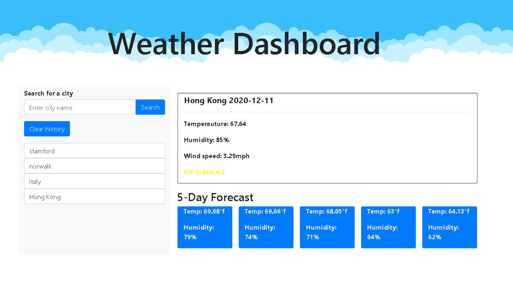

# Weather Dashboard

## Project overview      

### To create a coding formate for our website that is up to accessibilty standards
- To create a weather dash board with form inputs
- When searching for a city, the city is added to search history
- Current weather should present city name, date, weather conditions, temperature, humidity windspeed, and UV index
- UV index should be color coded indicating if conditions are favorable, moderate, or severe
- Should present a 5 day forecast for the city searched

### Tools used in creating site
- Jquery
- Javascript
- HTML
- CSS
- Bootstrap

### Issues resolved
- Figuring out how to loop the 5 day forecast for the city searched
- Getting the API info implemented to the page

### Link to website
https://amarz94.github.io/weather-dashboard/
